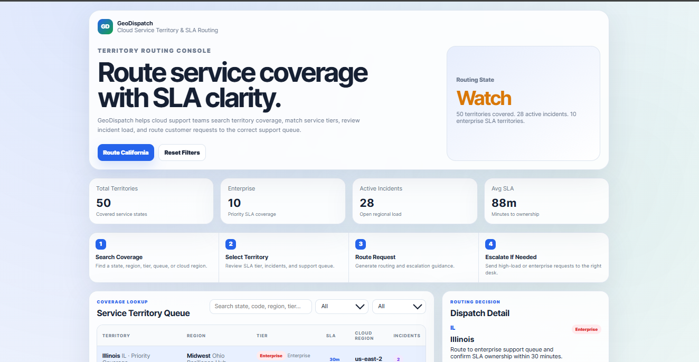
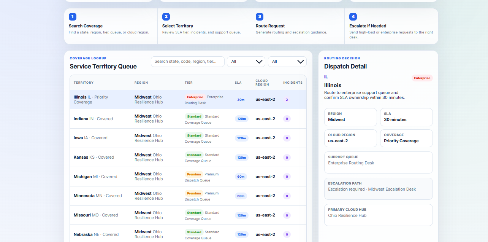
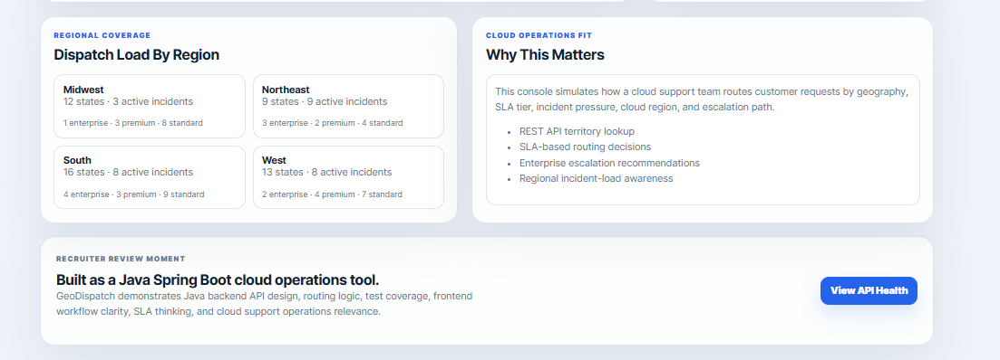

# GeoDispatch Cloud Service Territory & SLA Routing Console

## Overview

GeoDispatch is a Java Spring Boot cloud operations console for service territory lookup, SLA routing, regional incident awareness, and dispatch decision support.

It upgrades a simple Java state-search console into a full-stack internal operations tool with a REST API, frontend dashboard, routing logic, tests, Docker readiness, and recruiter-facing documentation.

## Screenshots

### Dashboard Overview



### Routing Detail



### Regional Operations Summary



## Real-World Use Case

Cloud support teams often need to route customer requests based on geography, service tier, incident load, escalation rules, and cloud-region ownership. GeoDispatch simulates that workflow by mapping each U.S. state to a support tier, SLA window, cloud region, dispatch queue, and routing recommendation.

GeoDispatch helps answer:

- Is this state covered?
- Which cloud region owns this territory?
- What SLA applies to this customer area?
- Should the request go to standard, premium, or enterprise support?
- Does active incident load require escalation?
- Which support queue should own the next action?

## Key Features

- Java Spring Boot full-stack application
- Static frontend served by the Spring Boot backend
- REST API for territory lookup and routing decisions
- 50-state service coverage model
- SLA tier logic for Enterprise, Premium, and Standard support
- Cloud region and data center mapping
- Regional incident-load summary
- Escalation recommendation engine
- JUnit service tests
- Docker-ready project structure

## Tech Stack

- Java 17
- Spring Boot
- Spring Web MVC
- Maven
- JUnit
- HTML
- CSS
- JavaScript
- Docker

## Project Structure

```text
.
├── src/
│   ├── main/
│   │   ├── java/com/geodispatch/
│   │   │   ├── GeoDispatchApplication.java
│   │   │   ├── controller/
│   │   │   ├── model/
│   │   │   └── service/
│   │   └── resources/
│   │       ├── application.properties
│   │       └── static/
│   │           ├── index.html
│   │           ├── styles.css
│   │           └── app.js
│   └── test/java/com/geodispatch/
├── docs/
│   ├── architecture.md
│   └── screenshots/
├── legacy-console-original/
├── pom.xml
├── Dockerfile
└── README.md
```

## How To Run Locally

```powershell
mvn spring-boot:run
```

Open the application:

```text
http://localhost:8080
```

## Run Quality Checks

```powershell
mvn test
mvn package
```

## API Endpoints

| Method | Endpoint | Purpose |
|---|---|---|
| GET | `/api/health` | Confirms backend service health |
| GET | `/api/territories` | Returns all enriched territory records |
| GET | `/api/territories?q=California` | Searches territories by keyword |
| GET | `/api/territories?region=West` | Filters territories by region |
| GET | `/api/territories?tier=Enterprise` | Filters territories by support tier |
| GET | `/api/coverage/{stateCode}` | Returns coverage details for one state |
| GET | `/api/route/{stateCode}` | Returns SLA routing and escalation decision |
| GET | `/api/routing-summary` | Returns territory portfolio metrics |

## Logic Model

GeoDispatch enriches each territory with:

- State Name And Code
- Region
- Cloud Region
- Primary Data Center
- Support Queue
- Service Tier
- SLA Minutes
- Coverage Status
- Active Incident Count
- Escalation Recommendation

Routing decisions consider:

- Enterprise support status
- Active incident load
- SLA urgency
- Region ownership
- Cloud routing desk
- Standard versus premium dispatch needs

## Cloud Support Relevance

GeoDispatch demonstrates practical cloud support operations:

- REST API design in Java
- Internal operations dashboard design
- SLA-based routing logic
- Escalation decision support
- Cloud region mapping
- Regional incident-load awareness
- Java service testing
- Container-readiness for cloud deployment

## Docker Usage

```powershell
docker build -t geodispatch-cloud-routing-console .
docker run -p 8080:8080 geodispatch-cloud-routing-console
```

## Recruiter Review Points

A recruiter or technical reviewer can quickly see:

- Java Spring Boot backend design
- REST API endpoint structure
- Cloud-support routing logic
- SLA and escalation thinking
- Frontend workflow clarity
- JUnit test coverage
- Docker deployment readiness
- Practical internal-tool positioning

## Planned Enhancements

- Add authentication and role-based access
- Add PostgreSQL or DynamoDB persistence
- Add customer address geocoding
- Add cloud provider region failover logic
- Add ticketing integrations such as Jira or ServiceNow
- Add incident and dispatch audit history
- Add CI workflow for automated Maven tests

